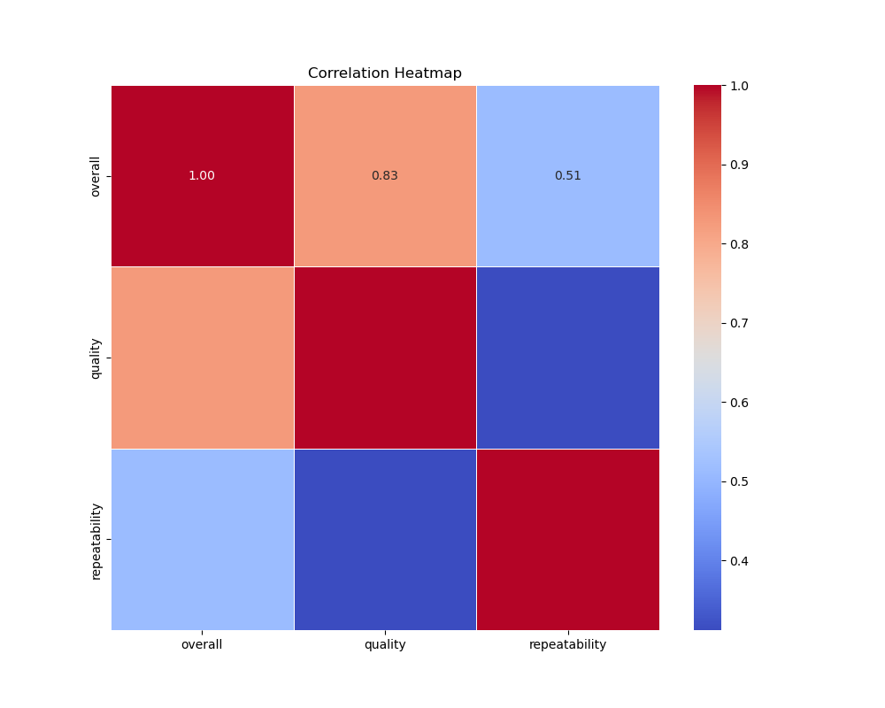
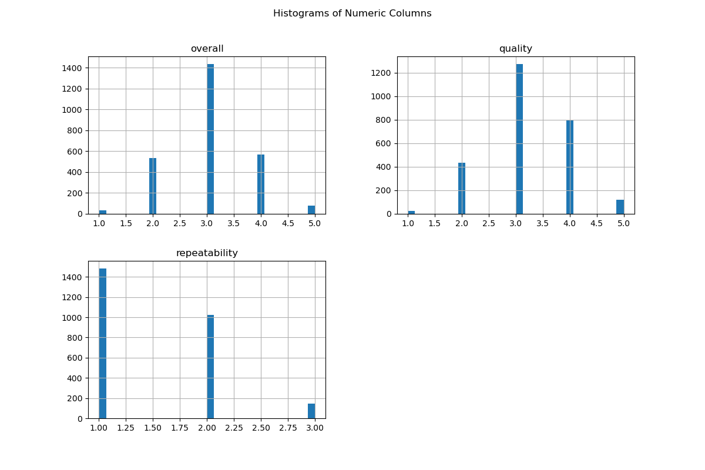

# Data Analysis Report

## Summary Statistics
|       |    overall |     quality |   repeatability |
|:------|-----------:|------------:|----------------:|
| count | 2652       | 2652        |     2652        |
| mean  |    3.04751 |    3.20928  |        1.49472  |
| std   |    0.76218 |    0.796743 |        0.598289 |
| min   |    1       |    1        |        1        |
| 25%   |    3       |    3        |        1        |
| 50%   |    3       |    3        |        1        |
| 75%   |    3       |    4        |        2        |
| max   |    5       |    5        |        3        |

## Missing Values
|               |   0 |
|:--------------|----:|
| date          |  99 |
| language      |   0 |
| type          |   0 |
| title         |   0 |
| by            | 262 |
| overall       |   0 |
| quality       |   0 |
| repeatability |   0 |

## Correlation Heatmap

## Histograms

## Conclusion
The analysis provides insight into the dataset's correlations, distributions, and outliers. The clustering analysis suggests potential groupings that could be useful for further analysis.